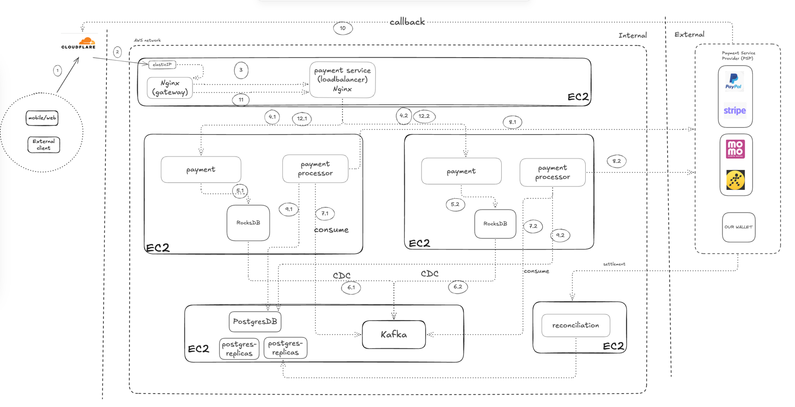
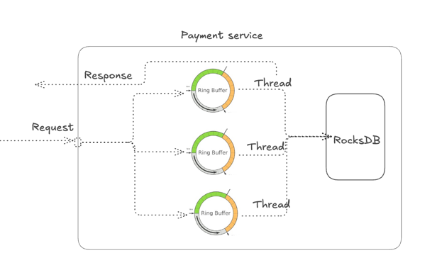

the image below is deployment diagram of mini payment system 

## Tech-stack:

1. Using Cloudflare to resolve domain and route to public IP which register in AWS
2. Deploy to EC2 on AWS
3. Use Nginx for gateway and LoadBalancer
4. Quarkus (can build native in GraalVM) to build payment, payment processor, CDC, ...
5. Kafka as message queue
6. RocksDB, PostgresDB

## Explain flow:

(1) user checkout payment with API 

POST ../payments --headers {X-PAYMENT-CHECKOUT-ID} 
{..} 

(2) : cloudflare route to Nginx gateway 

(3) : Nginx gateway route to payment service LB, at here Nginx use consistent to shard
request to payment service base on X-PAYMENT-CHECKOUT-ID in headers 

(4.1) and (4.2) : request is routed to payment service (nginx apply sharding) 

(5.1) and (5.2) : payment service will process requests save to RocksDB (embedded database) 

+ Each RocksDB will deploy with payment service together on each instance and will persistent with EBS (AWS)
+ At payment service, we can apply ring-buffer to implement batch process to rocksDB. So we will check payment_check_id has existed or not(if existed should response to client due to retry)
+ Because RocksDB is key-value storage, so key = payment_checkout_id (will get from payload), value = json (binary data which is generated by grpc)
+ After save batch and will response to user with payment_check_id and status = "pending" (user will use this response to call get status of payment with poling mechanism)

(6.1) and (6.2) The RocksDB will enable WAL to help sync data to Kafka
, we can implement by java. 

(7.1) and (7.2) The payment processor will consume payment event. We can set partition of topic is high to make high through-put

(8.1) and (8.2) will call to external to execute payment (as PSP, our wallet, ...) within payment_checkout_id (idempotent)
We can set partition of topic is high to make high performance
and can apply retry or DLQ when error or external down.

(9.1) and (9.2) will save data (event + response from external) to Postgres

(10) The external system can callback by webhook
(11), (12.1), (12.2) will route payment service to update status
=> User will call each 2s to get status of payment. (The api get so fast because rocksDB is key-value)

Besides steps above, we need to reconciliation service to recon/settle payment data from internal and external
to make sure payment execute correctly on daily or monthly

## Answer questions 

1,2,3: Done

4. Actually, To client <> server calls be under 3ms is very difficult. it's depend
on network, traffic at a time. However, I still think how can optimize request/response by 
+ Saving data to RocksDB(embedding + key/value storage). The payment call to RocksDB will not impact by network => ultra fast
+ Also, data is sharded by nginx load-balancer to reduce latency to service 
+ I also build service to native by Quarkus (framework of java) has optimize response time
+ All EC2 must be allocated nearest

5. Secure in both external API call and internal API call.
+ At Ingress (client, External call) and Egress (payment processor call to external) must be 
  + Using HTTPs
  + Validate Ip from API relate to External
+ Internal service call each other, we can implement mTLS
+ Rate limit to prevent DDoS
+ Apply checksum to check unique request
+ PCI compliance

5. Sharding data, can user partition of topics in kafka make order execution to handle concurrency to data
